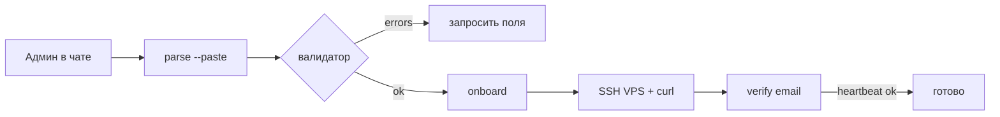

# Оператор: подключение партнёра через агента

> **Для:** Алексей + Cursor / Cloud Agent  
> **Когда:** подключение партнёра «в один заход» из чата с агентом

**Скилл (любой агент, без разбора системы):**  
[`.cursor/skills/leads-partner-onboard/SKILL.md`](../.cursor/skills/leads-partner-onboard/SKILL.md)  
Триггер: «подключи партнёра» / блок Email+Profi+IP. Этот файл — детали CLI.

Агент **не** хранит пароли в git. Секреты — только в чате или stdin скрипта на сервере.

---

## Философия

| Канал | Роль |
|-------|------|
| **Cursor-агент + CLI** | Полное подключение: парсинг → валидация → БД → install-команда → verify |
| **Админка** | Обзор, лимиты, ручные правки |
| **Помощник в UI** | Быстрые команды без SSH |

Один и тот же путь: `scripts/operator/cli.ts` — **единый валидатор**.

---

## Что писать агенту в чат

Скопируйте блок (пример):

```text
Email: partner@example.ru
Пароль входа: Partner2026
Имя: Иван
Profi логин: specialist_login
Profi пароль: profi_secret
Лимит: 500
Chat ID: 123456789
Bot Token: 123456:ABC...
IP: 159.194.213.198
Ключевые слова: сайт, лендинг
```

Агент должен:

1. `npm run operator:parse -- --paste` (или `--file /tmp/partner.txt`)
2. Если ✅ — `npm run operator:onboard -- --paste`
3. SSH на VPS → выполнить `curl install.sh` из вывода
4. `npm run operator:verify -- partner@example.ru`

**SSH root-пароль** — только для ручного SSH админа. В БД и скрипты **не** пишем.

---

## Команды (на сервере хаба)

```bash
cd /var/www/www-root/data/www/leads.konversus.ru

# 1. Парсинг + валидация (без создания)
npm run operator:parse -- --paste <<'EOF'
Email: ...
EOF

# 2. Dry-run
npm run operator:onboard -- --dry --paste <<'EOF'
...
EOF

# 3. Создать партнёра
npm run operator:onboard -- --paste <<'EOF'
...
EOF

# Или явные аргументы (без paste)
npm run operator:onboard -- \
  --email partner@example.ru \
  --password 'Partner2026' \
  --profiLogin specialist \
  --profiPassword 'secret' \
  --leadsPerMonth 500 \
  --vpsIp 159.194.213.198

# 4. Проверка после install на VPS
npm run operator:verify -- partner@example.ru
```

---

## Чеклист verify (✅ / ❌)

| Проверка | Ожидание |
|----------|----------|
| user | партнёр существует, role=user |
| workspace | id workspace |
| quota | used/limit, сбор вкл |
| period | срок не истёк |
| telegram | chat + token (warn если нет) |
| profi_source | login + enabled |
| agent_heartbeat | online < 15 мин после install |
| vps_ip | IP записан |
| install_cmd | curl … install.sh |
| circuit_breaker | CLOSED / HALF_OPEN |

---

## VPS install (после onboard)

На **VPS партнёра** (не на хабе 109.196.165.106):

```bash
ssh root@IP_ПАРТНЁРА
# команда из вывода onboard или verify (install_cmd)
curl -fsSL https://leads.konversus.ru/agent/v2/install.sh | bash -s "SOURCE_ID"
pm2 status   # leads-agent-v2 online
```

Политика: **никакого Playwright Profi на хабе** (`profiOnHub: false`).

---

## Агент: типовой сценарий



---

## Ошибки

| Симптом | Действие |
|---------|----------|
| Email уже существует | `operator:verify` или админка → Партнёры |
| heartbeat offline | SSH VPS, `pm2 logs leads-agent-v2` |
| quota стоп | Лимиты → Продлить месяц |
| CB OPEN | Система / alert TG, не рестартить Profi на хабе |

---

## Файлы

| Путь | Назначение |
|------|------------|
| `scripts/operator/cli.ts` | parse / onboard / verify |
| `scripts/operator/parse.ts` | парсер + валидатор |
| `scripts/operator/onboard.ts` | создание в БД |
| `scripts/operator/verify.ts` | чеклист |
| `docs/PARTNER-ONBOARDING.md` | детальный онбординг |
